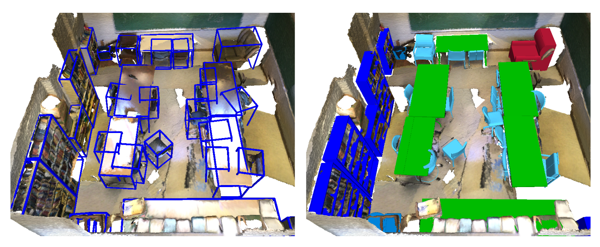

# HOC-Search: Efficient CAD Model and Pose Retrieval From RGB-D Scans

<p align="center">

<br>
<a href="https://arxiv.org/pdf/2309.06107">arXiv</a>
</p>

This repository contains the code for HOC-Search proposed in the 3DV 2024 paper "HOC-Search: Efficient CAD Model and Pose Retrieval From RGB-D Scans". 

### 🔧 Installation:

Installation guide tested for Ubuntu 24.04 on a  NVIDIA GeForce RTX 4090 with CUDA 12.4 and Python 3.9.

- Prepare Environment
```sh
conda create -n HOC-Search python==3.9
conda activate HOC-Search

conda install pytorch==2.4.1 torchvision==0.19.1 torchaudio==2.4.1 pytorch-cuda=12.4 -c pytorch -c nvidia
conda install -c iopath iopath
pip install scikit-image matplotlib imageio plotly opencv-python
pip install trimesh
```
In case you run into `GLIBCXX_3.4.32' not found error, try (do this before installing PyTorch3D, otherwise reinstall PyTorch3D):
```sh
conda install -c conda-forge libstdcxx-ng=12  
```

Install PyTorch3D:
```sh
cd submodules
git clone https://github.com/facebookresearch/pytorch3d.git
cd pytorch3d && pip install -e .
```

Install MonteScene for MCTS:
```sh
cd submodules
git clone https://github.com/vevenom/MonteScene.git
cd MonteScene && pip install .
```

## Data preprocessing for ShapeNet

### ShapeNet

Download the [ShapenetCoreV2](https://huggingface.co/datasets/ShapeNet/ShapeNetCore) dataset. Extract data to `./data/ShapeNet`.

To center and scale-normalize the downloaded ShapeNet CAD models, run:
```bash
bash run_shapenet_prepro.sh gpu=0
```
The `gpu` argument specifies which GPU should be used for processing. 
By default, code is executed on CPU.

### Cluster Trees for Object Categories
Download the pre-build tree structures for the individual categories [here](https://cloud.tugraz.at/index.php/s/NA7icqiJ5SeNSA6?dir=/HOC_Search/cluster_trees).
Copy them to `./data`.

After the above-mentioned steps the `./data` folder should contain the following directories:
```text
- data
    - ShapeNet
        - ShapeNet_preprocessed
            - 02747177
            - ...            
        - ShapeNetCore.v2
            - 02747177
            - ... 
    - ShapeNetCore.v2.PC15k_tree
        - ...
```

## Run HOC-Search for ScanNet

### Download example
Download the ScanNet example [here](https://cloud.tugraz.at/index.php/s/NA7icqiJ5SeNSA6?dir=/HOC_Search/ScanNet_example). Extract
the folders `extracted, preprocessed, scans` and copy them to `./data/ScanNet`.

### Run HOC-Search method
To run HOC-Search for ScanNet, use:
```sh
bash run_CAD_retrieval_HOC_Search_ScanNet.sh config=ScanNet_HOC_Search.ini gpu=0
```
Model output will be stored in `./output`.

## Run HOC-Search for ScanNet++

### Download example
* Download the ScanNet++ example [here](https://cloud.tugraz.at/index.php/s/NA7icqiJ5SeNSA6?dir=/HOC_Search/ScanNetpp_example). Extract
the folders `data, preprocessed` and copy them to `./data/ScanNetpp`.

### Run HOC-Search method
To run HOC-Search for ScanNet++, use:
```sh
 bash run_CAD_retrieval_HOC_Search_ScanNetpp.sh config=ScanNetpp_HOC_Search.ini gpu=0
```
Model output will be stored in `./output`.


## Citation
How to cite this work:
```bibtex
@inproceedings{ainetter2024hoc,
  title={HOC-Search: Efficient CAD Model and Pose Retrieval From RGB-D Scans},
  author={Ainetter, Stefan and Stekovic, Sinisa and Fraundorfer, Friedrich and Lepetit, Vincent},
  booktitle={2024 International Conference on 3D Vision (3DV)},
  pages={944--953},
  year={2024},
  organization={IEEE}
}
```
